# SQL Explorer

A desktop client for SQL databases. It connects to MS SQL Server, AWS Athena,
PostgreSQL, MySQL, MariaDB and SQLite. It shows the objects of each server in a
tree, runs statements in tabs, and writes the results to a file.

The application is built with Vue 3, Vuetify and [Tauri 2](https://tauri.app/).

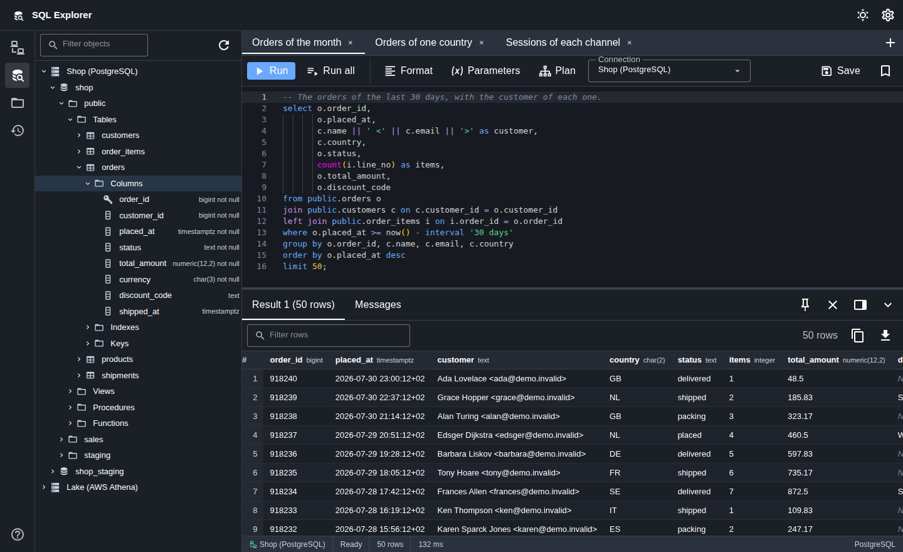

## Screenshots

Every picture below comes from the interface with sample connections and
sample rows. No server, no user and no row in them is real.

### Connections

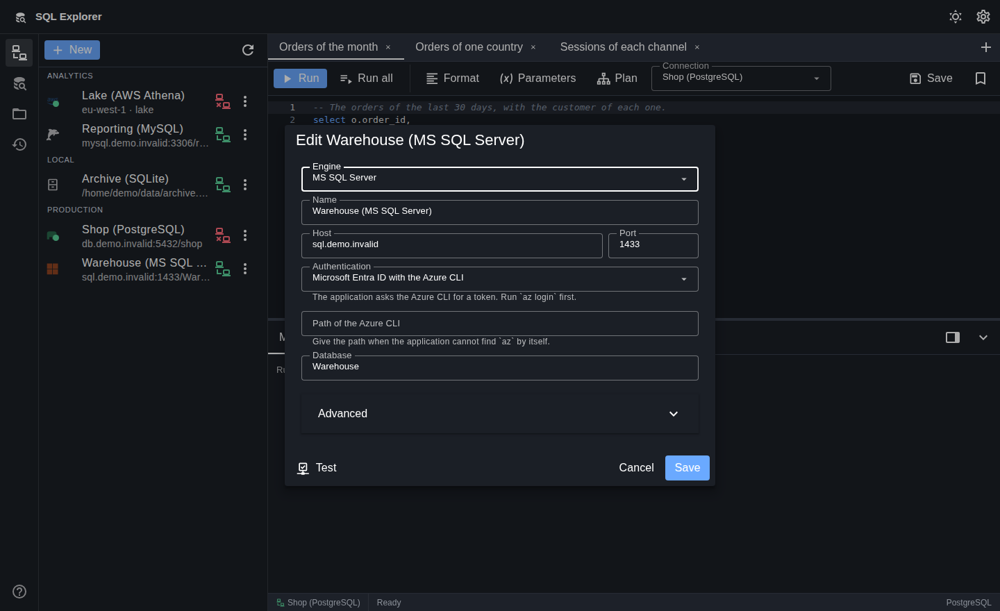

The list groups the connections into folders and marks the state of each one.
The form shows the fields of the engine that the user chose. This connection
takes its login from Microsoft Entra ID through the Azure CLI, so the form
holds no password.

### Objects

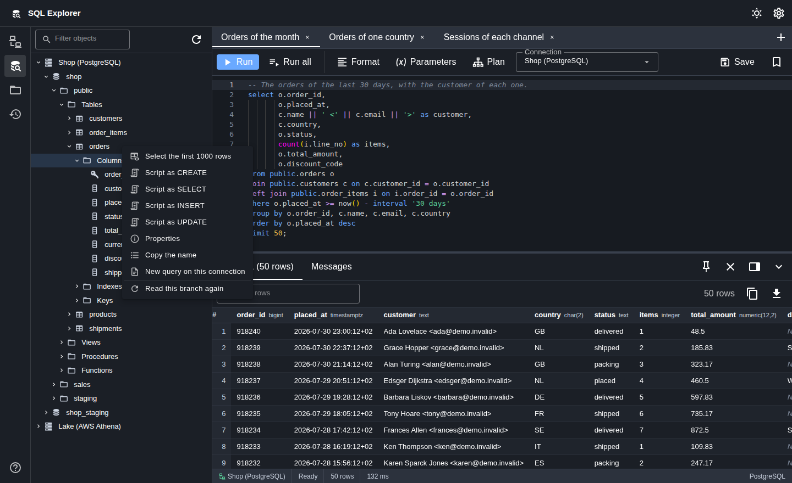

The tree holds the databases, the schemas, the tables, the views and the
columns of each connection. A key column carries its own icon, and each column
shows its type. The menu of an object builds a preview statement and the CREATE,
SELECT, INSERT and UPDATE statements of that object.

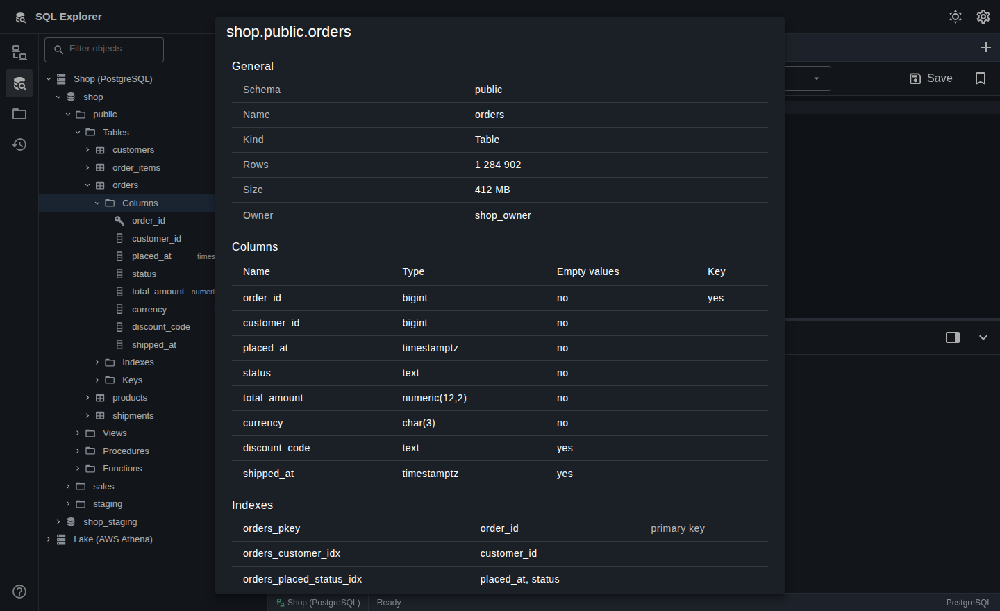

The Properties dialog holds the facts of a relation, its columns, its indexes
and its constraints, in one call to the backend.

### Statements

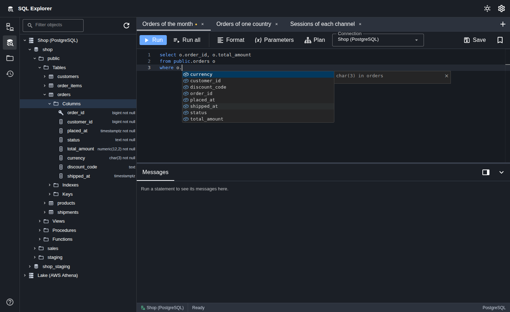

The editor completes the names of the database. A name after a full stop gives
the columns of the table that the alias in front of the stop names, with the
type of each column.

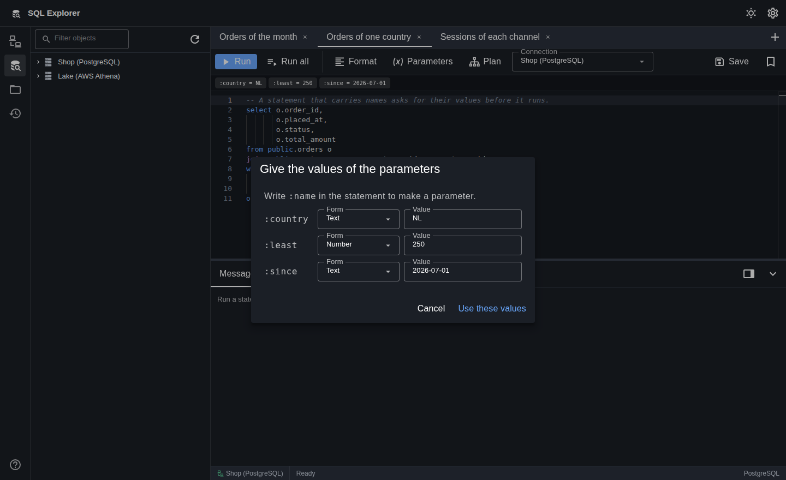

A statement that carries a name such as `:country` asks for the values before
it runs. Each value holds the form that the user chose, so a value stays text
when it looks like a number. The bar above the editor names the parameters and
their values.

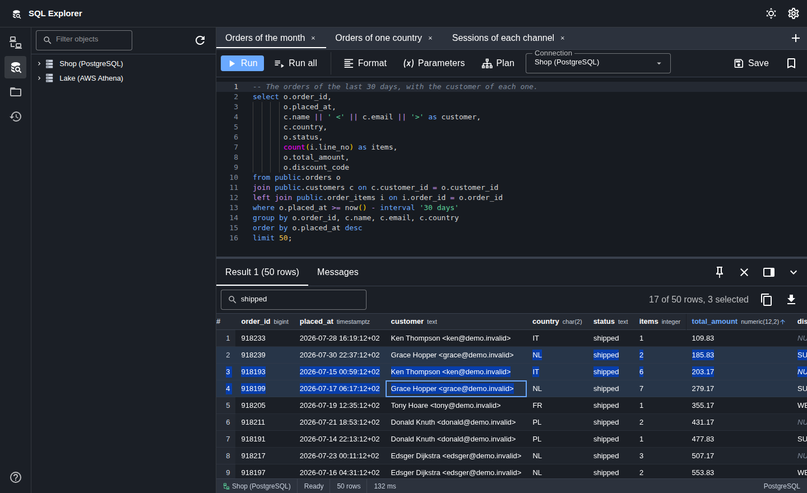

The result grid draws only the rows in view, so a large result stays quick. It
sorts, it filters, it marks a value that is absent, and it counts the rows that
the user selected.

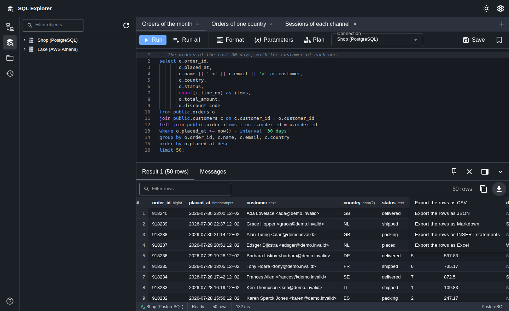

The rows go to a CSV, JSON, Markdown, INSERT or Excel file, or to the
clipboard. A whole result goes to a file from the backend, so the rows do not
pass through the interface.

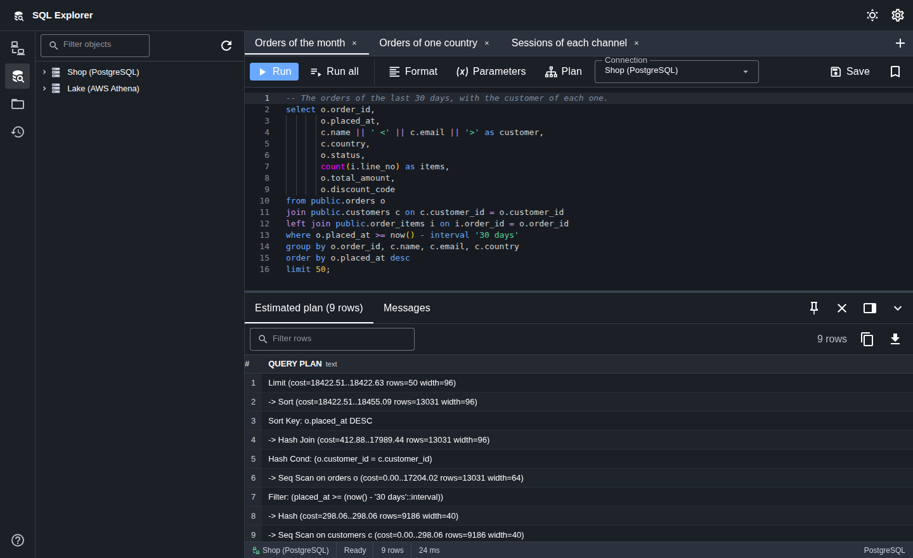

A plan tab shows the plan of one statement. The estimated plan needs no run.
The actual plan runs the statement, and the interface asks first.

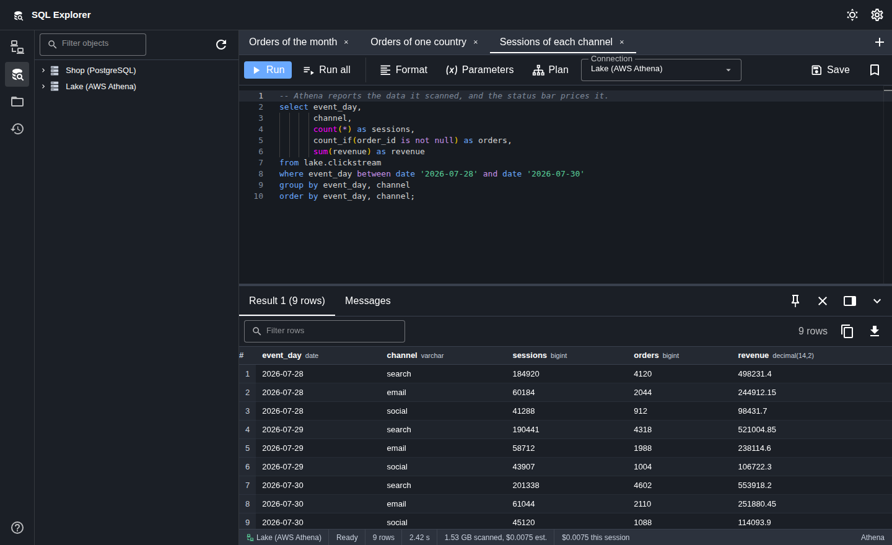

For Athena the status bar reports the data that the statement scanned, the
cost of that scan and the cost of the session. The price for each terabyte
stands in the settings.

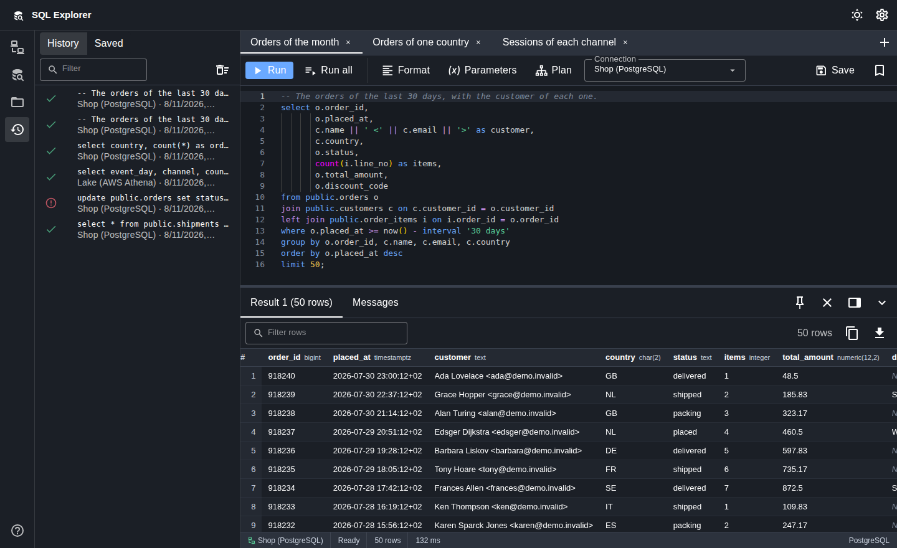

The panel holds every statement that ran, with its connection, its time and
its result. A second tab holds the statements that the user saved. Both
persist across a restart.

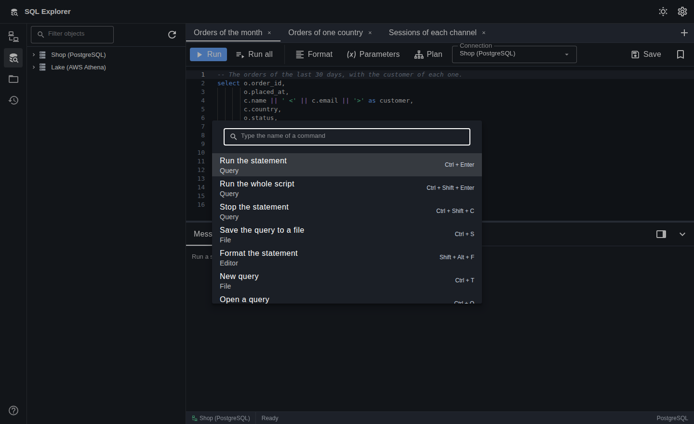

One registry holds every key of the application. The palette lists the
commands with the keys that reach them.

## What it does

**Connections**

- Five engines: MS SQL Server, AWS Athena, PostgreSQL, MySQL and MariaDB, and
  SQLite.
- The form shows the fields the selected engine uses and hides the rest.
- A test button opens the connection, confirms that it answers, and closes it.
- Transport settings: verify the certificate, encrypt without a check, encrypt
  when the server offers it, or send in clear text. The first is the default.
- A named MS SQL Server instance resolves its port through the SQL Browser
  service.
- Four ways to authenticate against MS SQL Server: a SQL login, the account of
  the user, Microsoft Entra ID through the Azure CLI, and an access token that
  the user gives. The account of the user reaches the server through SSPI on
  Windows and through Kerberos on macOS and Linux.
- An Athena connection takes its credentials from the AWS tools of the machine,
  with a profile name, or from an access key ID, a secret access key and an
  optional session token that the user pastes into the form. The two secrets go
  into the keychain of the operating system.
- An Athena connection can reuse the result of an earlier run up to an age that
  the user gives, which costs nothing because the engine scans no data.
- Timeouts for the connection and for a statement, a row limit, a read-only
  session, an application name, folders and colours.
- One server session for each tab, so the statements of two tabs run at the
  same time. The temporary tables, the `SET` options and the transactions of
  a tab stay with the session of that tab. A session limit in the options of
  the connection bounds the sessions of one server, with six as the default.
- Passwords go into the keychain of the operating system. The settings file
  holds no password.
- A connection that stops answering is opened again, and the interface shows
  the state of each connection.

**Statements**

- One editor for each tab, with syntax colours and completion that draws on the
  objects of the database. Completion after a full stop offers the columns of
  the table that the alias in front of the stop names.
- `Ctrl` or `Cmd` with `Enter` runs the statement under the cursor. The same
  keys with `Shift` run the whole script. A selection runs in place of the
  statement.
- One registry holds every key of the application, and a palette lists the
  commands with the keys that reach them.
- A script runs statement by statement. The splitter respects quotes, comments,
  dollar tags and the MySQL `DELIMITER` command.
- The formatter of the dialect lays out the statement, through the format
  command of the editor or a button.
- A statement that carries a name such as `:id` opens a dialog for the values.
  Each value holds the form the user chose, so a value stays text when it looks
  like a number. Every engine but Athena binds the values.
- A plan tab shows the plan of one statement. The estimated plan needs no run.
  The actual plan runs the statement, and the interface asks first.
- The Messages tab holds what the server sent, with the severity, the code, the
  line and the procedure of each message.
- A statement that runs can be stopped, and the time limit of the connection
  stops one that runs too long.
- The result grid draws only the rows in view, so a large result stays quick. It
  sorts, filters, marks a value that is absent, and opens a wide value.
- Results go to a CSV, JSON, Markdown, INSERT or Excel file, or to the
  clipboard. A whole result goes to a file from the backend, so the rows do not
  pass through the interface.
- A result tab can be pinned. It then holds its rows and the time of its run
  against the next statement, so two results stand beside each other.
- The File menu of the operating system opens a query in a new tab, opens a
  query from a file, opens a folder of queries, and writes the query that
  stands open. The keys of a desktop reach the same four commands.
- The status bar reports the rows and the time, and it counts the time up
  while a statement runs. For Athena it reports the data scanned with the cost
  at a rate the settings hold.
- The history and the saved statements persist, and so do the open tabs with
  their parameter values.

**Objects**

- Databases, schemas, tables, views and columns. A key column carries its own
  icon, and each column shows its type.
- Folders hold the tables, the views, the routines, the indexes, the constraints
  and the partitions of a schema or a relation.
- A filter box keeps the path down to each match.
- The context menu builds a preview statement in the backend, so every name is
  quoted for the engine. It also builds the statements of an object: a CREATE
  draft, a SELECT, an INSERT, an UPDATE and a DELETE. The CREATE of a table is a
  draft, because it holds no index, no default and no constraint.
- A Properties dialog holds the facts of a relation, its columns, its indexes
  and its constraints, in one call to the backend.
- One command reads every relation of a database, and the completion of the
  editor then knows a name that the tree has not opened.

## Prerequisites

1. **Node.js and pnpm.** Node 20.19 or later, or 22.12 or later. Install pnpm
   with `npm install -g pnpm`.
2. **Rust.** Install the toolchain through [rustup](https://rustup.rs/).
3. **The system libraries of Tauri.** See below for Linux.

### Linux

Tauri 2 needs WebKitGTK 4.1. On Ubuntu 24.04 or Debian 13:

```sh
sudo apt update
sudo apt install -y \
    libwebkit2gtk-4.1-dev \
    libgtk-3-dev \
    libayatana-appindicator3-dev \
    librsvg2-dev \
    libxdo-dev \
    libssl-dev \
    pkg-config \
    build-essential \
    curl wget file
```

An earlier version of this application used Tauri 1, which needs
`libsoup-2.4` and `webkit2gtk-4.0`. Neither package ships on Ubuntu 24.04 or on
Debian 13, so that version could not be built there. Tauri 2 removes the
problem.

### macOS

Install the command line tools of Xcode: `xcode-select --install`.

### Windows

Install the C++ build tools of Visual Studio and the WebView2 runtime.

## Setup

```sh
pnpm install
```

The `prepare` script points git at the hooks of this repository.

## Development

```sh
pnpm dev
```

This starts the Vite server and builds the Rust binary with hot reloading for
the interface.

## Building

```sh
pnpm build
```

This command makes the macOS application bundle and the `.dmg` image, and
then it cross-compiles the Windows NSIS installer. The `app` and `dmg` bundle
formats build on macOS only, so the command stops on an other operating
system. The macOS installers appear under `backend/target/release/bundle/`.
The Windows installer appears under
`backend/target/x86_64-pc-windows-msvc/release/bundle/nsis/`. To build only
one operating system, run `pnpm build:macos` or `pnpm build:windows`.

The Windows cross-compilation needs these tools on the macOS machine:

```sh
rustup target add x86_64-pc-windows-msvc
cargo install cargo-xwin
brew install nsis llvm
```

`cargo-xwin` downloads the Windows SDK and the MSVC headers on the first
build. The MSI format needs the WiX toolset, which runs on Windows only, so a
build on macOS makes the NSIS installer and not the MSI installer.

## Tests and linters

```sh
pnpm test           # every unit test, both halves
pnpm test:unit      # the frontend only
pnpm test:coverage  # the frontend with a coverage report
pnpm lint           # ESLint, clippy and the formatters
pnpm format         # Prettier and rustfmt
pnpm verify         # the linters and then the tests
```

A pre-commit hook runs the formatters, the linters and the unit tests, and it
stops a commit that does not pass. Run `git commit --no-verify` to step past it
when you know why.

### Tests against a live server

The unit tests need no server. SQLite runs in memory, and the other drivers are
covered by tests of their configuration, their type conversion and their
statement splitting.

## Layout

```
backend/          The Rust half
  src/
    commands.rs   The commands the interface calls
    db.rs         The shared data model
    db/drivers/   One file for each engine
    error.rs      The error type and the payload the interface receives
    secrets.rs    The keychain of the operating system
    sql.rs        Quoting rules, the statement splitter and the parameters
    state.rs      The open connections and the statements that run
    storage.rs    The connection record and its options
    store.rs      The settings, the history and the saved statements
frontend/         The Vue half
  src/
    components/   The views
    layouts/      The shell of the application
    lib/          The calls to the backend and the pure helpers
    stores/       The state of the interface
    types/        The shapes the backend sends
docs/             The state of the work and the limits of the application
```

## What it does not do

- The interface holds no transaction control and no edit of a row in the grid.
  One part comes first: a session generation that the reconnection path
  checks.
- `docs/LIMITATIONS.md` records every other limit, with its cause. Read it
  before you report a defect. It covers the copy of `tiberius` that the build
  holds, the `PRINT` text of MS SQL Server, the ciphers that `rustls` refuses,
  the catalog of Athena, and the way a parameter changes a batch on MS SQL
  Server.

## Notes on the design

**The backend builds every connection configuration.** No component joins a
connection string by hand. An earlier version did, and the string lost the port
of every MS SQL Server connection, because the parser of `tiberius` reads the
port only from inside the `server` value. The same string lost any password that
held a semicolon or a brace.

**Errors carry their reason.** A failed command returns a kind, a message and
the chain of causes. An earlier version replaced every database error with one
fixed sentence, which made a set of deterministic faults look like intermittent
behaviour.

**Each connection holds its own lock.** One slow statement no longer blocks the
other connections.

**Rows are arrays and not objects.** A statement can return two columns with the
same name, and an object would lose one of them.

## Licence

MIT
