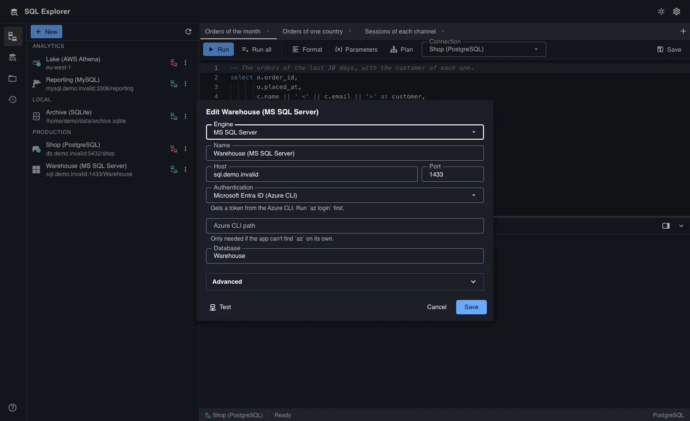

# Getting started

This guide explains how to use SQL Explorer. These steps take you from a new
installation to the first result.

1. Download the build for your operating system from the
   [releases page](https://github.com/wetherc/sql-explorer/releases). There is
   a `.dmg` for macOS, and a `.deb` package, an `.rpm` package and an AppImage
   for Linux.
2. Open the connections panel from the rail on the left, and click
   **New connection**.
3. Pick the engine, and fill in the fields that the form shows. Click **Test**
   to check that the server answers, then click **Save**.
4. Click the **Connect** button beside the connection. The explorer then lists
   the connection's databases, schemas, tables and views.
5. Open a tab with **+** in the tab row, or press `Ctrl`/`Cmd` + `T`. Pick the
   connection at the top of the tab, and write a statement.
6. Click **Run** to run the statement under the cursor, or **Run all** to run
   the whole script. The rows appear in the results grid below the editor.

{: width="1440" height="880" loading="lazy" decoding="async"}

## Topics in this guide

- [Connections](connections.html): the transport modes, read-only sessions,
  the authentication methods of MS SQL Server, and the result reuse of AWS
  Athena.
- [The object explorer](explorer.html): browse databases, schemas, tables,
  views and triggers, and script their CREATE, SELECT, INSERT and UPDATE
  statements.
- [Tabs and saved statements](tabs.html): work in several tabs, use the
  history, and save statements to files or to the library.
- [Run and stop](running.html): run a statement or a script, read the server's
  messages and the plan, and stop a statement.
- [Parameters](parameters.html): use named parameters such as `:country`, and
  give their values when the statement runs.
- [The results grid](results.html): sort, filter and select rows, and read the
  status bar.
- [Exports and row limits](exports.html): export rows to CSV, JSON, Markdown,
  INSERT statements or Excel, and set the row limits.
- [Keyboard shortcuts](keyboard.html): the shortcuts of the editor, the tabs,
  the panels, the explorer and the grid.
