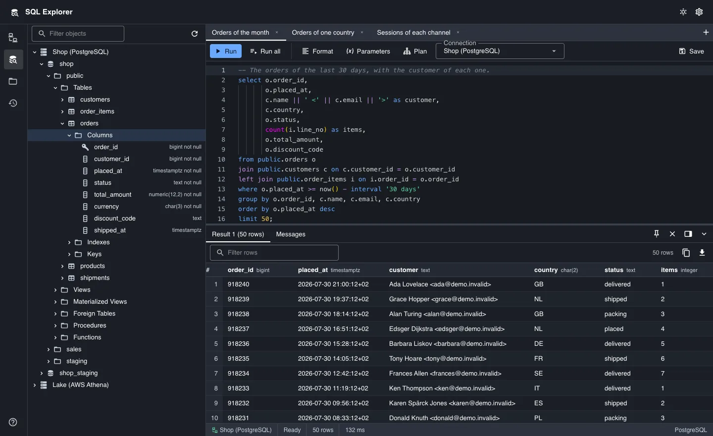
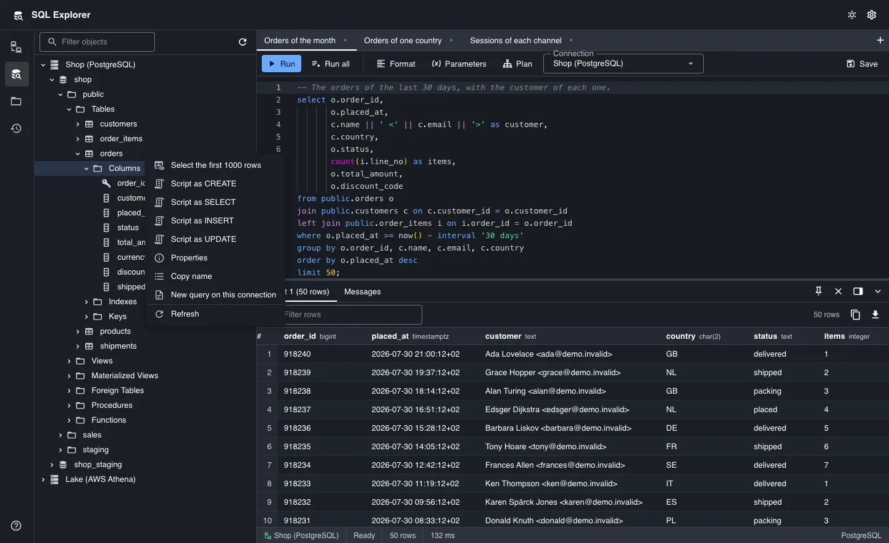
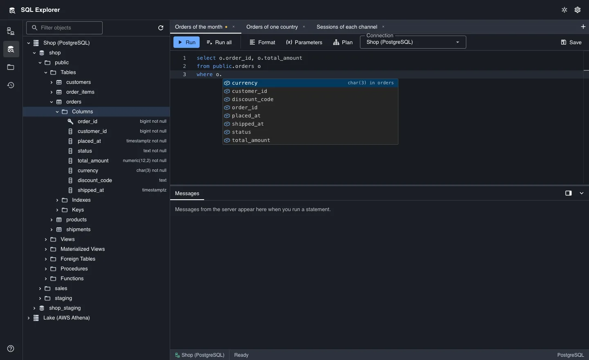
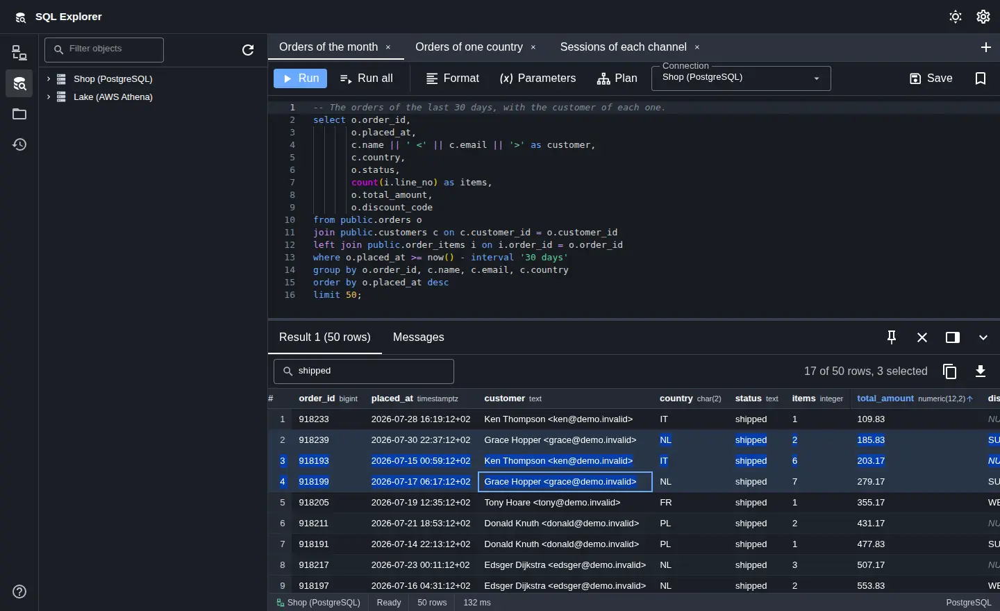
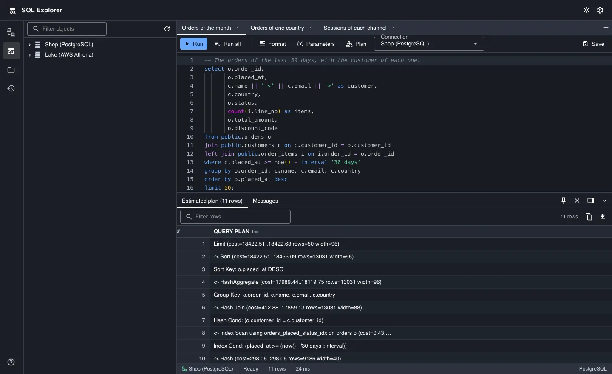
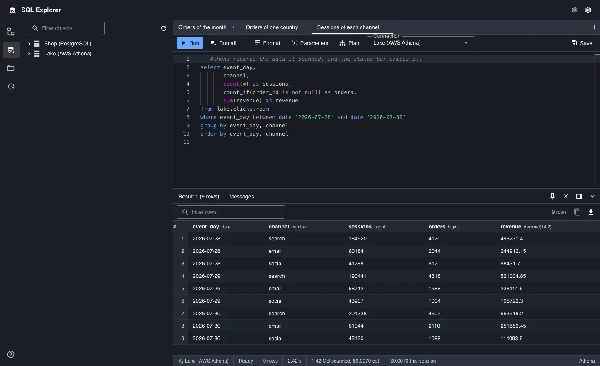
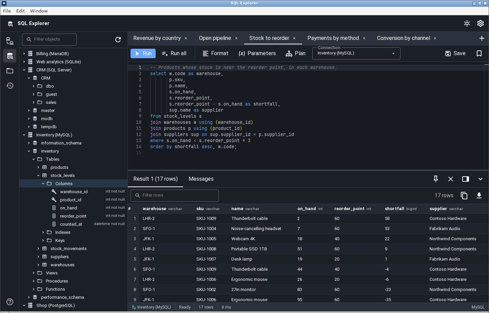
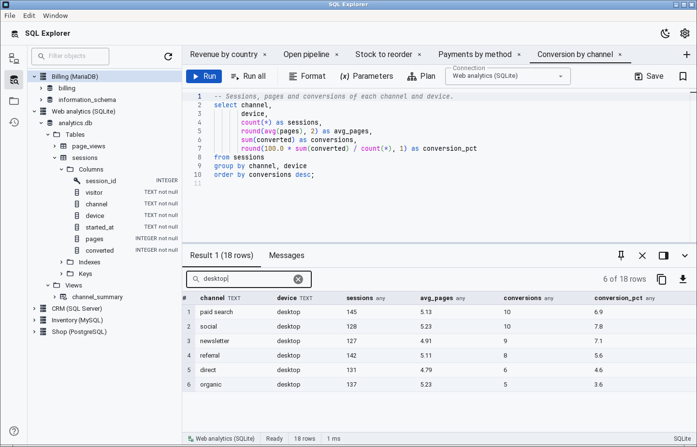

SQL Explorer is an open source desktop client for SQL databases that runs on
macOS, Windows and Linux. If you work on a Mac and miss SQL Server Management
Studio (SSMS) or Azure Data Studio, SQL Explorer gives you an alternative to
both.

It connects to:

- MS SQL Server, with a SQL login, your own account (SSPI on Windows, Kerberos
  on macOS and Linux), Microsoft Entra ID through the Azure CLI, or an access
  token
- AWS Athena, with each statement's scan cost in the status bar
- PostgreSQL
- MySQL and MariaDB
- SQLite

{: width="1440" height="880" decoding="async"}

## Browse a server's objects

The tree lists each connection's databases, schemas, tables, views and
columns. An object's context menu scripts its CREATE, SELECT, INSERT and
UPDATE statements, and the Properties dialog shows a table's columns, indexes
and constraints.

{: width="1440" height="880" loading="lazy" decoding="async"}

## Write and run queries

The editor completes table and column names, including the columns behind an
alias. Every tab gets its own server session, so two tabs can run queries at
the same time. When a query uses a named parameter such as `:country`, the
editor asks for its value before the query runs.

{: width="1440" height="880" loading="lazy" decoding="async"}

## Read and export results

The result grid draws only the rows on screen, so large results stay fast. You
can sort and filter the rows and see how many you have selected. Export them to
CSV, JSON, Markdown, INSERT statements or Excel, or copy them to the clipboard.

{: width="1440" height="880" loading="lazy" decoding="async"}

## Read a statement's plan

A plan tab shows a statement's estimated or actual execution plan.

{: width="1440" height="880" loading="lazy" decoding="async"}

## Query AWS Athena

The status bar shows how much data each statement scanned, what that scan
cost, and what the session has cost so far. A connection can also reuse an
earlier result up to an age you choose, and a reused result scans no data.

{: width="1440" height="880" loading="lazy" decoding="async"}

## Run it on Linux

The Linux build comes as a `.deb` package, an `.rpm` package and an AppImage.
Passwords go to your desktop's Secret Service, such as GNOME Keyring or
KWallet. The screenshot below has five sample servers open at once:
PostgreSQL, MS SQL Server, MySQL, MariaDB and SQLite.

{: width="1442" height="925" loading="lazy" decoding="async"}

{: width="1442" height="925" loading="lazy" decoding="async"}

## Keep your secrets safe

Passwords and AWS secret keys live in your operating system's keychain, and the
settings file never contains a password. Every connection verifies the
server's certificate by default.

## Get it

Download a build from the
[releases page](https://github.com/wetherc/sql-explorer/releases), or build it
from source with the steps below. SQL Explorer is free and open source under
the MIT license.

### Build from source

Every platform needs Node.js 20.19 or later (or 22.12 or later), pnpm and a
Rust toolchain from [rustup](https://rustup.rs/). Install pnpm with
`npm install -g pnpm`, then clone the repository and install its
dependencies:

```sh
git clone https://github.com/wetherc/sql-explorer.git
cd sql-explorer
pnpm install
```

#### macOS

Install Xcode's command line tools, then build the app bundle and the `.dmg`
image:

```sh
xcode-select --install
pnpm build:macos
```

You'll find both under `backend/target/release/bundle/`.

#### Windows

Install the Visual Studio C++ build tools and the WebView2 runtime, then build
the NSIS installer:

```sh
pnpm tauri build --bundles nsis
```

You can also cross-compile the Windows installer on a Mac. Add the Windows
target and the tools it needs, then run `pnpm build:windows`:

```sh
rustup target add x86_64-pc-windows-msvc
cargo install cargo-xwin
brew install nsis llvm
pnpm build:windows
```

`cargo-xwin` downloads the Windows SDK and the MSVC headers on its first run.
The installer lands in
`backend/target/x86_64-pc-windows-msvc/release/bundle/nsis/`. A Mac can't
build the MSI installer, because the WiX toolset runs only on Windows.

#### Linux

SQL Explorer uses Tauri 2, which needs WebKitGTK 4.1. On Ubuntu 24.04 or
Debian 13, install the system libraries and then build the packages:

```sh
sudo apt update
sudo apt install -y \
    libwebkit2gtk-4.1-dev \
    libgtk-3-dev \
    libayatana-appindicator3-dev \
    librsvg2-dev \
    libxdo-dev \
    libssl-dev \
    libkrb5-dev \
    clang \
    pkg-config \
    build-essential \
    curl wget file
pnpm build:linux
```

The `libkrb5-dev` headers and `clang` let the build include Windows
authentication (Integrated Security) for MS SQL Server. The `.deb` package,
the `.rpm` package and the AppImage land in `backend/target/release/bundle/`.

For development builds, tests and the rest of the toolchain, see the
[README](https://github.com/wetherc/sql-explorer#setup).
