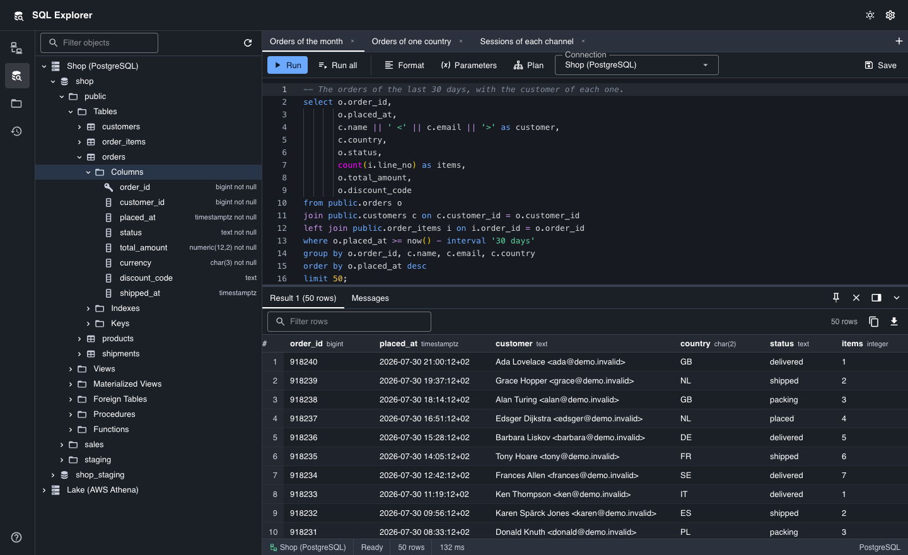
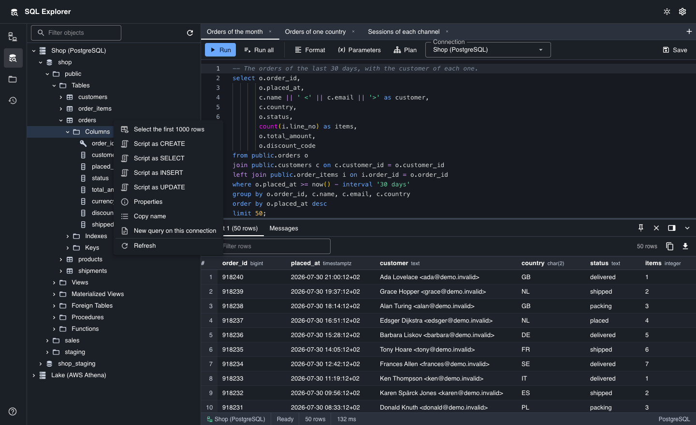
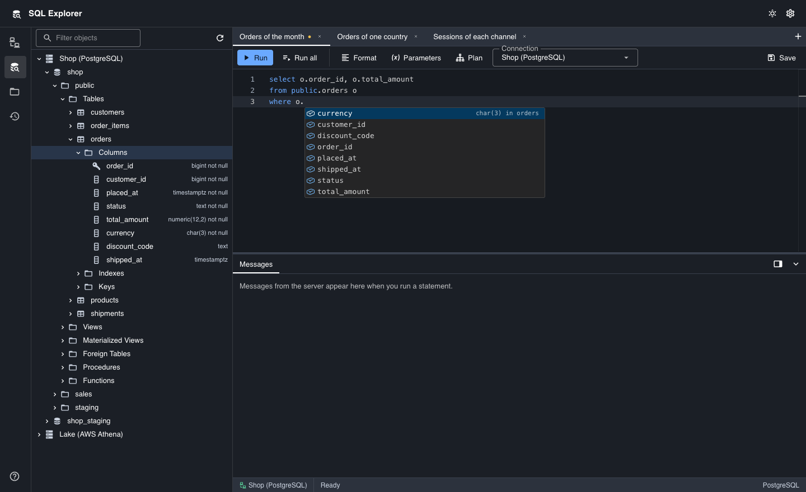
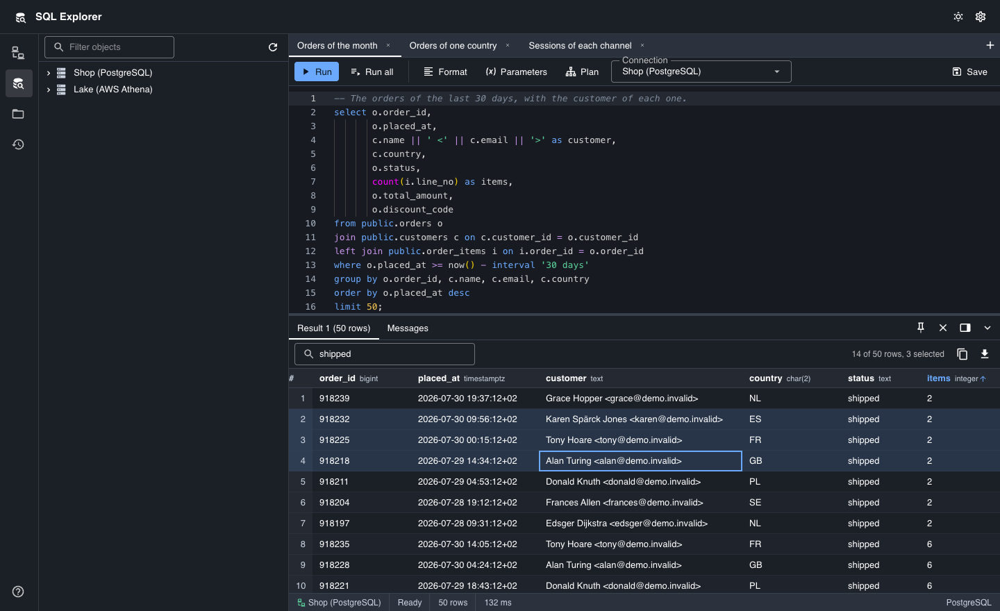
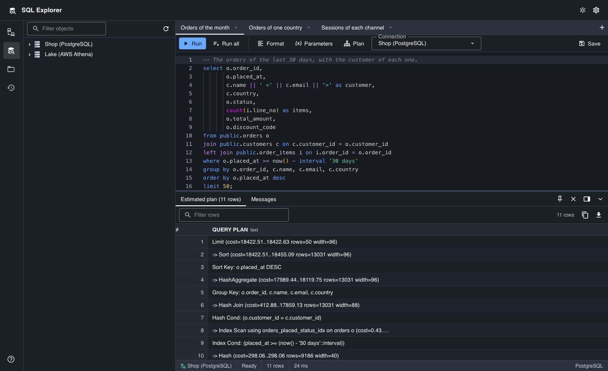
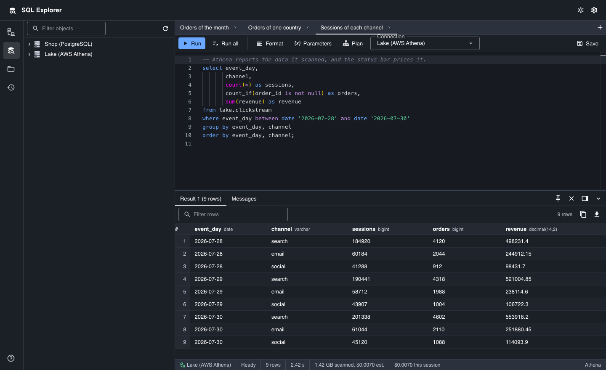

SQL Explorer is an open source desktop client for SQL databases. It runs on
macOS, Windows and Linux. It is an alternative to SQL Server Management Studio
(SSMS) and Azure Data Studio for users who work on a Mac.

It connects to these engines:

- MS SQL Server, with a SQL login, the account of the user (SSPI on Windows,
  Kerberos on macOS and Linux), Microsoft Entra ID through the Azure CLI, or an
  access token
- AWS Athena, with the scan cost of each statement in the status bar
- PostgreSQL
- MySQL and MariaDB
- SQLite

[Get SQL Explorer on GitHub](https://github.com/wetherc/sql-explorer) ·
[Releases](https://github.com/wetherc/sql-explorer/releases) ·
[Report a defect](https://github.com/wetherc/sql-explorer/issues)

## Explore the objects of a server

The tree holds the databases, the schemas, the tables, the views and the
columns of each connection. The menu of an object writes its CREATE, SELECT,
INSERT and UPDATE statements. The Properties dialog shows the columns, the
indexes and the constraints of a table.

## Write and run statements

The editor completes the names of tables and columns, and the columns that
follow an alias. Each tab has its own server session, so two tabs can run
statements at the same time. A statement with a named parameter such as
`:country` asks for its values before it runs.

## Read and export the results

The result grid draws only the rows in view, so a large result stays fast. It
sorts, filters and counts the selected rows. The rows go to a CSV, JSON,
Markdown, INSERT or Excel file, or to the clipboard.

## Read the plan of a statement

A plan tab shows the estimated plan or the actual plan of a statement.

## Query AWS Athena

The status bar shows the data that each statement scanned, the cost of that
scan and the cost of the session. A connection can reuse an earlier result up
to an age that you set, and that reuse scans no data.

## Keep your secrets safe

Passwords and AWS secret keys go into the keychain of the operating system. The
settings file holds no password. Each connection verifies the certificate of
the server by default.

## Get it

Download a build from the
[releases page](https://github.com/wetherc/sql-explorer/releases), or build it
from the source with the steps in the
[README](https://github.com/wetherc/sql-explorer#setup). SQL Explorer is free
and open source under the MIT licence.

See the [limitations](LIMITATIONS) before you report a defect.
